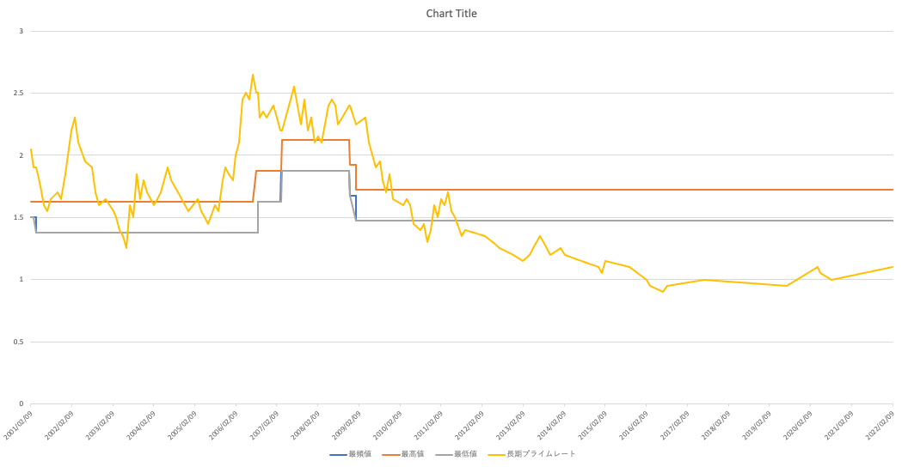

# Convert Primerate to CSV
## これは何?
日銀が公開する[長・短期プライムレート(主要行)の推移](https://www.boj.or.jp/statistics/dl/loan/prime/prime.htm/)が
非常に見にくいので、これをCSV形式として出力するもの

出力した値をExcelに貼り付ければグラフ化しやすい

## Prerequisites
* Ruby >= 3.1.0
* Bundler 2.3.3

## How to run
### Install gem files
```bash
bundle install
```

### Run the script
```ruby
ruby main.rb
```

## 参考
2022-05-05時点でのプライムレートをグラフ化したもの

